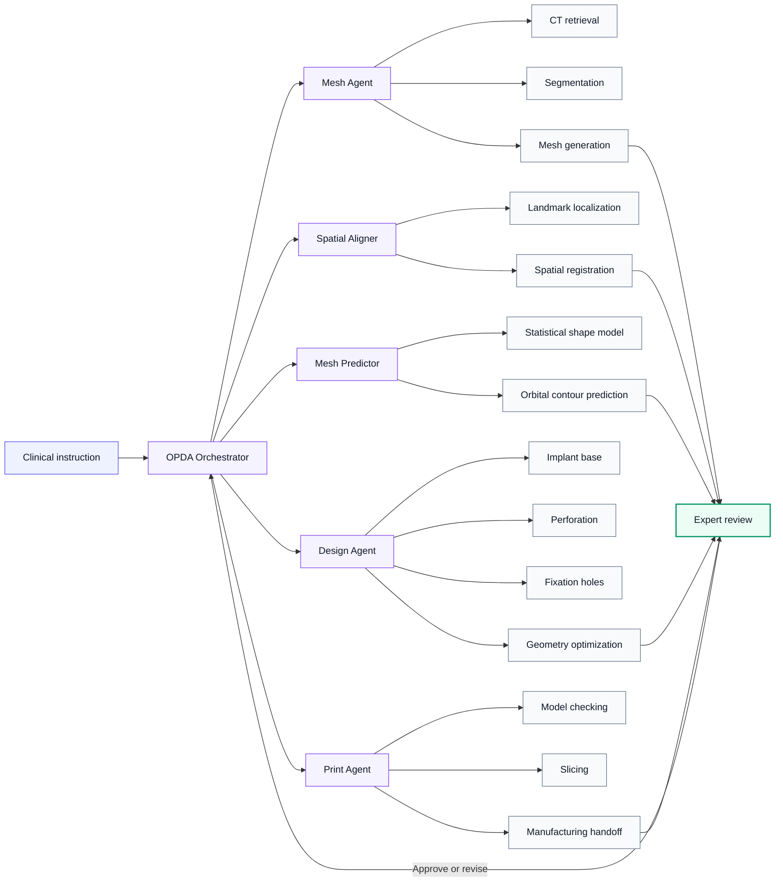
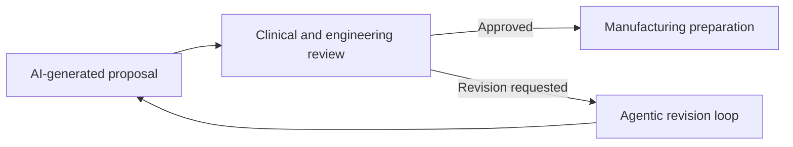

<div align="center">

<br>

# 🦾 

### OPDA: Orbital PSI Design Agent

**Human-supervised agentic AI for point-of-care design of patient-specific orbital implants**

<br>

[](#project-status)
[](#software-release)
[](#human-oversight)
[](#overview)

<br>

**[Overview](#overview) · [Architecture](#system-architecture) · [Results](#evaluation-highlights) · [Release](#software-release) · [Responsible Use](#responsible-use) · [Contact](#contact)**

<br>

> OPDA translates natural-language clinical instructions into three-dimensional orbital implant designs while keeping clinicians and biomedical engineers in control of all safety-critical decisions.

<br>

</div>

---

## Overview

**OPDA** is a human-supervised agentic AI system for the design of patient-specific implants used in orbital fracture reconstruction.

It combines specialized AI agents, multimodal foundation models, statistical shape modelling, and deterministic geometry-processing tools in one coordinated workflow:

**clinical instruction → anatomical reconstruction → orbital prediction → implant design → expert review → manufacturing preparation**

Unlike a single end-to-end model, OPDA decomposes the task into interpretable steps, selects dedicated tools for each step, checks intermediate outputs, and revises the implant according to expert feedback.

> [!IMPORTANT]
> OPDA is a research prototype. It does not independently diagnose patients, determine treatment indications, or replace clinical and engineering review.

---

## At a Glance

<table>
<tr>
<td align="center" width="25%">
<h3>168</h3>
Printed PSI–skull assemblies
</td>
<td align="center" width="25%">
<h3>15</h3>
Participating clinical units
</td>
<td align="center" width="25%">
<h3>9.03 min</h3>
Mean design time
</td>
<td align="center" width="25%">
<h3>3.88 / 5</h3>
Mean usability score
</td>
</tr>
<tr>
<td align="center">
<h3>55% → 81%</h3>
First-pass acceptance
</td>
<td align="center">
<h3>USD 1.91</h3>
Estimated cost per case
</td>
<td align="center">
<h3>0.93</h3>
Segmentation Dice score
</td>
<td align="center">
<h3>0.65 mm</h3>
Orbital prediction error
</td>
</tr>
</table>

<sub>
Results were obtained in the evaluated research setting and should not be interpreted as guaranteed performance across institutions, scanners, patient populations, or manufacturing environments.
</sub>

---

## Why OPDA?

Conventional orbital implant design may require several software packages, repeated surgeon–engineer communication, extensive manual mesh editing, and hours of specialist work.

OPDA transforms this fragmented process into a coordinated agentic workflow.

<table>
<tr>
<td width="33%" valign="top">

### 💬 Clinical interaction

Clinicians describe design intent using natural language rather than manually operating every geometry-processing function.

</td>
<td width="33%" valign="top">

### 🧠 Agentic orchestration

Specialized agents plan tasks, invoke deterministic tools, inspect intermediate outputs, and request revision when needed.

</td>
<td width="33%" valign="top">

### 🧑‍⚕️ Human control

Experts approve segmentation, orbital prediction, implant geometry, fixation strategy, and the final manufacturing handoff.

</td>
</tr>
</table>

---

## System Architecture



---

## Core Modules

| Module | Main responsibility |
|---|---|
| **OPDA Orchestrator** | Interprets user intent, plans the workflow, coordinates agents, and manages revision loops |
| **Mesh Agent** | Retrieves CT data, segments craniofacial anatomy, and generates standardized surface meshes |
| **Spatial Aligner** | Localizes anatomical landmarks and standardizes model position and orientation |
| **Mesh Predictor** | Estimates the intended orbital contour using statistical shape modelling |
| **Design Agent** | Generates the implant base and applies perforation, hollowing, fixation, clearance, and geometry operations |
| **Print Agent** | Checks final models, prepares manufacturing files, and supports expert-reviewed fabrication handoff |
| **Memory System** | Reuses institution-specific expert feedback without sharing patient-level data across centres |

---

## End-to-End Workflow

```text
01  Import or retrieve preoperative CT data
02  Segment the craniofacial anatomy
03  Generate and standardize the skull mesh
04  Detect landmarks and align the anatomy
05  Estimate the intended orbital contour
06  Generate the initial implant base
07  Add perforations, fixation holes, and structural constraints
08  Inspect and revise the implant geometry
09  Obtain expert approval
10  Export the final design for manufacturing review
```

### Example instruction

```text
Create a left orbital floor implant using the predicted healthy contour.
Maintain sufficient clearance from the infra-orbital rim, add clinically
appropriate perforations, and place fixation holes along the stable rim.
Return the final implant and a structured design report for expert review.
```

### Example outputs

```text
final_optimized_implant.stl
final_optimized_result.json
PSI_Final-<case>.stl
```

---

## Evaluation Highlights

OPDA was evaluated using simulated cases, printed implant–skull assemblies, multi-centre expert assessment, component-level benchmarks, and feedback-driven adaptation.

| Evaluation | Result |
|---|---:|
| Printed PSI–skull assemblies | **168** |
| Participating clinical units | **15** |
| Mean usability score | **3.88 / 5** |
| Mean design time | **9.03 min per case** |
| Estimated design cost | **USD 1.91 per case** |
| Conventional estimated labour cost | **USD 173 per case** |
| First-pass acceptance after memory adaptation | **55% → 81%** |
| EPC-Net segmentation Dice score | **0.93 ± 0.03** |
| EPC-Net HD95 | **2.62 ± 0.51 mm** |
| Internal orbital prediction mean surface distance | **0.65 mm** |

---

## Human Oversight

OPDA is designed around **mandatory expert approval**, not autonomous clinical execution.

Expert review is required for:

- segmentation quality;
- anatomical alignment;
- predicted orbital contour;
- implant coverage and geometry;
- perforation and fixation-hole placement;
- structural and manufacturing constraints;
- final release for fabrication.



---

## Feedback-Driven Memory

OPDA can convert expert corrections into reusable local design experience.

The memory system is intended to:

- improve first-pass design acceptance;
- adapt to institution-specific design preferences;
- reduce repeated interaction and revision;
- preserve human approval at safety-critical stages;
- avoid cross-centre sharing of patient-level data;
- operate without updating foundation-model weights.

> [!NOTE]
> Memory transferability may differ across design tasks. Some preferences, particularly fixation-hole placement, can remain strongly institution-specific.

---

## Software Release

The complete OPDA software is being prepared for public release as an integrated **Windows executable installer**.

The planned release is intended to minimize environment configuration and provide a unified interface for the full workflow.

### Planned distribution

| Component | Planned availability |
|---|---|
| Windows installer | Public release |
| Example instructions and outputs | Public release |
| User and installation guides | Public release |
| Demonstration videos | Public release |
| Evaluation scripts | Where permitted |
| Patient or restricted clinical data | **Not distributed** |
| External LLM credentials | Provided by the user |
| Local-model support | Available for selected modules |

Users will need to configure their own API credentials for external large-language-model services used by selected modules. Privacy-sensitive or institution-specific functions may be operated with locally hosted models.

<details>
<summary><strong>Planned repository structure</strong></summary>

```text
OPDA/
├── README.md
├── docs/
│   ├── system_overview.md
│   ├── installation.md
│   ├── user_guide.md
│   └── responsible_use.md
├── examples/
│   ├── example_instructions/
│   └── example_outputs/
├── assets/
│   ├── figures/
│   └── videos/
├── installer/
└── LICENSE
```

</details>

---

## Project Status

**Current stage:** research prototype, manuscript review, software packaging, documentation, and release preparation.

- [x] Agentic workflow development
- [x] Simulated-case evaluation
- [x] Multi-centre printed-model assessment
- [x] Feedback-driven memory evaluation
- [ ] Public Windows installer
- [ ] Demonstration cases
- [ ] Installation and user documentation
- [ ] Additional local-model backends
- [ ] Prospective clinical evaluation
- [ ] Regulatory and quality-management preparation

---

## Data and Privacy

OPDA was developed and evaluated using retrospective, de-identified data under institutional approvals and applicable data-use conditions.

The architecture supports:

- local processing of sensitive data;
- separation of patient data from external language-model prompts;
- institution-specific memory without cross-centre patient-level sharing;
- configurable local-model deployment;
- expert review before manufacturing.

Users are responsible for compliance with local ethics approvals, data-protection regulations, institutional policies, medical-device requirements, and quality-management procedures.

---

## Responsible Use

> [!WARNING]
> OPDA is not a certified medical device and must not be used as an autonomous clinical decision or manufacturing system.

OPDA must not be used to:

- independently diagnose a patient;
- determine whether surgery is indicated;
- replace qualified surgeons or biomedical engineers;
- directly manufacture an implant without expert review;
- process patient data without appropriate authorization;
- bypass institutional validation or quality-management procedures.

Any clinical or translational use requires independent validation, risk assessment, regulatory review, and approval by the responsible institution.

---

## Citation

A formal citation will be added after publication.

```bibtex
@article{gao_opda,
  title   = {Agentic AI for point-of-care design of patient-specific orbital implants},
  author  = {Gao, Yao and others},
  journal = {Under review},
  year    = {2026}
}
```

---

## Team and Collaboration

OPDA was developed through collaboration among clinicians, biomedical engineers, computer scientists, and manufacturing partners, coordinated by the oral and maxillofacial surgery research team at **KU Leuven and University Hospitals Leuven**.

Potential collaboration areas include:

- patient-specific implant design;
- agentic AI for surgery;
- craniofacial image analysis;
- statistical shape modelling;
- medical 3D printing;
- human–AI collaboration;
- multi-centre clinical validation.

---

## Contact

<table>
<tr>
<td>

**Yao Gao**  
Department of Oral and Maxillofacial Surgery  
KU Leuven / University Hospitals Leuven  
Leuven, Belgium  

📧 `yao.gao@kuleuven.be`

</td>
</tr>
</table>

---

## License

The software license and third-party component notices will be provided with the public release.

Until then, all rights are reserved unless explicitly stated otherwise.

---

<div align="center">

<br>

### From clinical intent to manufacturing preparation

**OPDA connects clinicians, computational modelling, and medical 3D printing through a human-supervised agentic AI workflow.**

<br>

</div>
