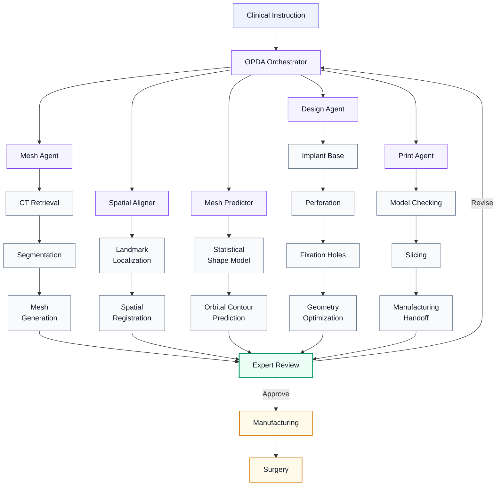
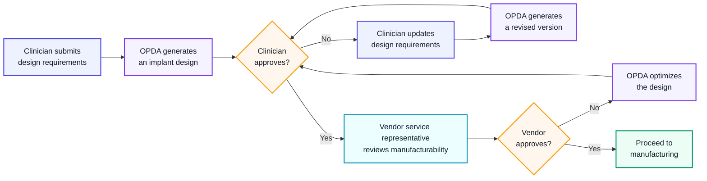

<a id="top"></a>

<div align="center">

<br>

# 

<br>

[](#project-status)
[](#software-release)
[](#human-opda-interaction)
[](#overview)

<br>

**[Overview](#overview) · [Why OPDA?](#why-opda) · [Architecture](#system-architecture) · [Core Modules](#core-modules) · [Usage](#how-to-use-opda) · [Evaluation](#evaluation-highlights) · [Human Interaction](#human-opda-interaction) · [Memory](#feedback-driven-memory)**

**[Software Release](#software-release) · [Project Status](#project-status) · [Data & Privacy](#data-and-privacy) · [Responsible Use](#responsible-use) · [Citation](#citation) · [Team](#team-and-collaboration) · [Contact](#contact) · [License](#license)**

<br>

</div>

---

<a id="overview"></a>

## Overview
**OPDA** is a human-in-the-loop AI agent system that automates the design of patient-specific orbital implants. By translating natural-language clinical text into 3D anatomical shapes, OPDA accelerates the reconstruction workflow while keeping safety-critical decisions firmly under clinician control."

<a id="end-to-end-workflow"></a>

### 🔄 End-to-End Workflow
**Instruction** ➔ **Anatomical Reconstruction** ➔ **Orbital Prediction** ➔ **Implant Design** ➔ **Expert Review** ➔ **Manufacturing**

<a id="key-features"></a>

### ✨ Key Features
* **Hybrid Core:** Integrates multimodal foundation models, statistical shape modeling, and deterministic geometry tools.
* **Interpretable Steps:** Unlike black-box methods, OPDA decomposes tasks, verifies intermediate outputs, and utilizes dedicated tools.
* **Human-in-the-Loop:** Continuously refines and revises implant geometry based on expert feedback.

> [!IMPORTANT]
> **Research Prototype Only.** <br>
> OPDA does not independently diagnose patients, determine treatment, or replace professional clinical and engineering review.

---

<a id="why-opda"></a>

## Why OPDA?
Traditional orbital implant design is fragmented, manual, and slow. **OPDA unifies this process into a coordinated, human-supervised AI workflow.**

<table width="100%">
<tr>
<td align="center" width="33%"><b>💬 Clinical Interaction</b><br><small>Translates natural language into structured design actions.</small></td>
<td align="center" width="34%"><b>🧠 Agentic Orchestration</b><br><small>Specialized agents plan, execute, and iterate automatically.</small></td>
<td align="center" width="33%"><b>🧑‍⚕️ Human Oversight</b><br><small>Experts retain control over design, fixation, and release.</small></td>
</tr>
</table>

---

<a id="system-architecture"></a>

## System Architecture


---
<a id="core-modules"></a>

## Core Modules
<table width="100%" cellpadding="10">

<tr>
<td align="center" valign="middle">
<b>🤖&nbsp;OPDA Orchestrator</b>&nbsp;<kbd>CONTROL</kbd><br>
<sub>Workflow planning, agent coordination, and revision management</sub>
</td>

<td align="center" valign="middle">
<b>📐&nbsp;Mesh Agent</b>&nbsp;<kbd>ANATOMY</kbd><br>
<sub>Anatomy segmentation, surface reconstruction, and mesh generation</sub>
</td>

<td align="center" valign="middle">
<b>🎯&nbsp;Spatial Aligner</b>&nbsp;<kbd>ALIGNMENT</kbd><br>
<sub>Landmark localization and standardized anatomical alignment</sub>
</td>
</tr>

<tr>
<td align="center" valign="middle">
<b>🔮&nbsp;Mesh Predictor</b>&nbsp;<kbd>PREDICTION</kbd><br>
<sub>Surface prediction via SSm and design of the intended orbital PSI base</sub>
</td>

<td align="center" valign="middle">
<b>🔨&nbsp;Design Agent</b>&nbsp;<kbd>DESIGN</kbd><br>
<sub>Implant modelling, perforation, fixation, and geometry optimization</sub>
</td>

<td align="center" valign="middle">
<b>🖨️&nbsp;Print Agent</b>&nbsp;<kbd>MANUFACTURING</kbd><br>
<sub>Model validation, fabrication preparation, and manufacturing handoff</sub>
</td>
</tr>

<tr>
<td colspan="3" align="center" valign="middle">
<b>💾&nbsp;Memory System</b>&nbsp;<kbd>ADAPTATION</kbd><br>
<sub>Secure reuse of institution-specific expert feedback and design experience</sub>
</td>
</tr>

</table>

---
<a id="how-to-use-opda"></a>

## How to Use OPDA
> 📚 **Tutorial book:** Coming soon (Pending release) <br>
> 🎬 **Tutorial Video:** Coming soon (Pending release) <br>

## 🌍 Global Collaboration

OPDA welcomes collaboration with clinicians, researchers, engineers, hospitals, and manufacturing partners worldwide.

We are particularly interested in:

* 🧑‍⚕️ Clinical and multi-centre validation
* 🤖 Agentic AI for surgical workflows
* 🦴 Patient-specific implant design
* 🩻 Craniofacial image analysis
* 📐 Statistical shape modelling
* 🖨️ Medical 3D printing
* 🧪 Prospective and in vivo evaluation

<p align="center">
  <b>Interested in collaborating with OPDA?</b><br>
  <a href="#contact">📬 Contact us to discuss potential opportunities</a>
</p>

---
<a id="evaluation-highlights"></a>

## Evaluation Highlights

<p align="center">


<br>


</p>

<p align="center"> <sub><i>These results represent preclinical performance in the evaluated research setting.</i></sub> </p>

> [!NOTE]
> 🧪 Current metrics reflect **preclinical evaluation**. <br>
> 📊 More experimental results are currently in progress. <br>
> 🤝 Collaborations from around the world are warmly welcome!

---

<a id="human-opda-interaction"></a>

## Human–OPDA Interaction


<p align="center">
  <sub>
    Revised or optimized designs must be approved by the clinician before manufacturing.
  </sub>
</p>


---

<a id="feedback-driven-memory"></a>

## Feedback-Driven Memory
OPDA converts expert corrections into reusable, institution-specific design experience, allowing future cases to benefit from previous review without sharing patient-level data or updating foundation-model weights.

<table width="100%" cellpadding="10">

<tr>
<td align="center" valign="middle">
<b>📈&nbsp; Higher First-Pass Acceptance</b><br>
<sub>Reuse validated corrections to improve initial design quality</sub>
</td>

<td align="center" valign="middle">
<b>🏥&nbsp; Local Adaptation</b><br>
<sub>Capture institution-specific design preferences and workflows</sub>
</td>

<td align="center" valign="middle">
<b>⚡&nbsp; Fewer Revisions</b><br>
<sub>Reduce repeated interaction and unnecessary redesign</sub>
</td>
</tr>

</table>

> [!NOTE]
> Memory effectiveness and transferability are task-dependent. Some preferences, particularly fixation-hole placement, may remain highly institution-specific.

---

<a id="software-release"></a>

## Software Release
OPDA is being prepared for public release as an integrated **Windows executable installer**, providing a unified interface without requiring users to manually configure the complete software environment.

<table width="100%" cellpadding="10">
<tr>
<td align="center" valign="middle">
<b>🪟&nbsp; Windows Installer</b>&nbsp;<kbd>PUBLIC</kbd><br>
<sub>Integrated executable package for streamlined installation</sub>
</td>

<td align="center" valign="middle">
<b>📖&nbsp; Documentation</b>&nbsp;<kbd>PUBLIC</kbd><br>
<sub>Installation guide, user manual, and responsible-use guidance</sub>
</td>

<td align="center" valign="middle">
<b>🧪&nbsp; Examples</b>&nbsp;<kbd>PUBLIC</kbd><br>
<sub>Example instructions, outputs, and demonstration videos</sub>
</td>
</tr>

<tr>
<td align="center" valign="middle">
<b>📊&nbsp; Evaluation Tools</b>&nbsp;<kbd>WHERE PERMITTED</kbd><br>
<sub>Selected evaluation scripts and reproducibility resources</sub>
</td>

<td align="center" valign="middle">
<b>🔐&nbsp; Clinical Data</b>&nbsp;<kbd>RESTRICTED</kbd><br>
<sub>Patient-level and restricted institutional data will not be distributed</sub>
</td>

<td align="center" valign="middle">
<b>🧠&nbsp; Model Access</b>&nbsp;<kbd>USER CONFIGURED</kbd><br>
<sub>External API credentials or supported locally hosted models</sub>
</td>
</tr>
</table>

> [!IMPORTANT]
> Users must provide their own API credentials for external large-language-model services. Privacy-sensitive and institution-specific modules may instead be operated using supported locally hosted models.

<details>
<summary><strong>📁 Planned repository structure</strong></summary>

```text
OPDA/
├── README.md
├── docs/
│   ├── system_overview.md
│   ├── installation.md
│   ├── user_guide.md
│   └── responsible_use.md
├── examples/
│   ├── example_instructions/
│   └── example_outputs/
├── assets/
│   ├── figures/
│   └── videos/
├── installer/
└── LICENSE
```

</details>

---

<a id="project-status"></a>

## Project Status
- [x] Agentic workflow development
- [x] Simulated-case evaluation
- [x] Multi-centre printed-model assessment
- [x] Feedback-driven memory evaluation
- [ ] Public Windows installer
- [ ] Demonstration cases
- [ ] Installation and user documentation
- [ ] Additional local-model backends
- [ ] Prospective clinical evaluation
- [ ] Regulatory and quality-management preparation

---

<a id="data-and-privacy"></a>

## Data and Privacy
OPDA was developed and evaluated using retrospective, de-identified data under institutional approvals and applicable data-use conditions.

<table width="100%" cellpadding="10">
<tr>
<td align="center" valign="middle">
<b>💻&nbsp; Local Processing</b><br>
<sub>Sensitive clinical data can remain within the institutional environment</sub>
</td>
<td align="center" valign="middle">
<b>🛡️&nbsp; Prompt Isolation</b><br>
<sub>Patient-identifiable information is excluded from external LLM prompts</sub>
</td>
<td align="center" valign="middle">
<b>🏥&nbsp; Institution-Specific Memory</b><br>
<sub>Local experience is reused without cross-centre patient-level sharing</sub>
</td>
</tr>
<tr>
<td align="center" valign="middle">
<b>🧠&nbsp; Local-Model Deployment</b><br>
<sub>Privacy-sensitive modules can use supported locally hosted models</sub>
</td>
<td align="center" valign="middle">
<b>🧑‍⚕️&nbsp; Expert Review</b><br>
<sub>Human approval remains mandatory before manufacturing release</sub>
</td>
<td align="center" valign="middle">
<b>📋&nbsp; Responsible Deployment</b><br>
<sub>Local validation, governance, and quality controls remain required</sub>
</td>
</tr>
</table>

> [!IMPORTANT]
> Users are responsible for compliance with applicable ethics approvals, data-protection laws, institutional policies, medical-device requirements, and quality-management procedures.

---

<a id="responsible-use"></a>

## Responsible Use
> [!WARNING]
> **OPDA is a research prototype and is not a certified medical device.**  
> It must not be used as an autonomous clinical decision-making or manufacturing system.

<table width="100%" cellpadding="10">
<tr>
<td align="center" valign="middle">
<b>🩺&nbsp; No Autonomous Diagnosis</b><br>
<sub>OPDA must not independently diagnose patients or interpret clinical conditions</sub>
</td>

<td align="center" valign="middle">
<b>⚖️&nbsp; No Treatment Decisions</b><br>
<sub>Surgical indications and treatment strategies must be determined by qualified clinicians</sub>
</td>

<td align="center" valign="middle">
<b>🧑‍⚕️&nbsp; No Expert Replacement</b><br>
<sub>OPDA supports, but does not replace, surgeons or biomedical engineers</sub>
</td>
</tr>

<tr>
<td align="center" valign="middle">
<b>🏭&nbsp; No Direct Manufacturing</b><br>
<sub>Implants must not be manufactured without clinical and engineering approval</sub>
</td>

<td align="center" valign="middle">
<b>🔐&nbsp; Authorized Data Only</b><br>
<sub>Patient data must be processed under appropriate authorization and governance</sub>
</td>

<td align="center" valign="middle">
<b>📋&nbsp; Institutional Oversight</b><br>
<sub>Local validation, risk management, and quality procedures must not be bypassed</sub>
</td>
</tr>
</table>

> [!IMPORTANT]
> ⚖️ **Use at Your Own Responsibility**  
> OPDA assumes no medical or legal liability. All generated designs must be independently reviewed and approved by qualified professionals. Users must accept these terms during installation.

> [!NOTE]
> 🔑 **API Access and Availability**  
> OPDA requires a supported API key for inference. Users should connect their own credentials. Limited trial tokens or complimentary credits may be available upon request. Availability of certain inference components may vary by region due to local service restrictions.

---

<a id="citation"></a>

## Citation
> 📄 **Usage Note:** <br>
> If you use **OPDA** or any of its related modules and components in your research or project, please cite our work using the formats below.

<div id="traditional-apa"></div>

### APA
```apa
Gao, Y., et al. (2026). Agentic AI for point-of-care design of patient-specific orbital implants. Under review.
```

<div id="bibtex"></div>

### BibTeX
```bibtex
@article{gao_opda,
  title   = {Agentic AI for point-of-care design of patient-specific orbital implants},
  author  = {Gao, Yao and others},
  journal = {Under review},
  year    = {2026}
}
```

---

<a id="team-and-collaboration"></a>

## Team and Collaboration
OPDA brings together clinicians, biomedical engineers, computer scientists, and manufacturing partners. The project is coordinated by the oral and maxillofacial surgery research team at **KU Leuven and University Hospitals Leuven**.

<table width="100%" cellpadding="10">
<tr>

<td align="center" valign="middle">
<b>🦴&nbsp; Patient-Specific Implants</b><br>
<sub>Automated planning and design of craniofacial implants</sub>
</td>

<td align="center" valign="middle">
<b>🤖&nbsp; Agentic AI for Surgery</b><br>
<sub>Tool-using AI systems for complex clinical workflows</sub>
</td>

<td align="center" valign="middle">
<b>🩻&nbsp; Craniofacial Image Analysis</b><br>
<sub>Segmentation, alignment, and anatomical reconstruction</sub>
</td>

</tr>
<tr>

<td align="center" valign="middle">
<b>📐&nbsp; Statistical Shape Modelling</b><br>
<sub>Patient-specific anatomical prediction and reconstruction</sub>
</td>

<td align="center" valign="middle">
<b>🖨️&nbsp; Medical 3D Printing</b><br>
<sub>Design-to-manufacturing integration and validation</sub>
</td>

<td align="center" valign="middle">
<b>🌍&nbsp; Multi-Centre Validation</b><br>
<sub>Clinical evaluation across institutions and specialties</sub>
</td>

</tr>
</table>

<p align="center">
  <sub>We welcome academic, clinical, engineering, and manufacturing collaborations related to OPDA.</sub>
</p>

---
<a id="contact"></a>
## 📬 Contact & Collaboration

### 👤 Project Contact
**Yao Gao**  
Department of Oral and Maxillofacial Surgery  
KU Leuven / UZ Leuven · Leuven, Belgium  
✉️ [yao.gao@kuleuven.be](mailto:yao.gao@kuleuven.be)

### 🎓 Academic Supervision
* **Prof. Dr. Robin Willaert** · KU Leuven / UZ Leuven  
* **Dr. Jeroen Van Dessel** · KU Leuven / UZ Leuven  
* **Dr. Yi Sun** · KU Leuven / UZ Leuven

---

<a id="license"></a>

## License
The software license and third-party component notices will be provided with the public release.

Until then, all rights are reserved unless explicitly stated otherwise.

---

<div align="center">

<br>

### From clinical intent to manufacturing preparation

**OPDA connects clinicians, computational modelling, and medical 3D printing through a human-supervised agentic AI workflow.**

<br>

</div>
