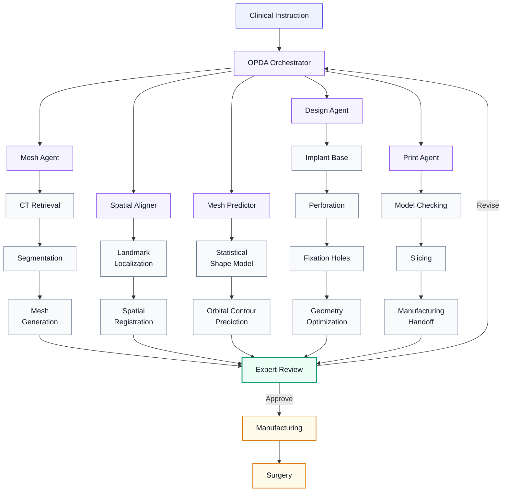
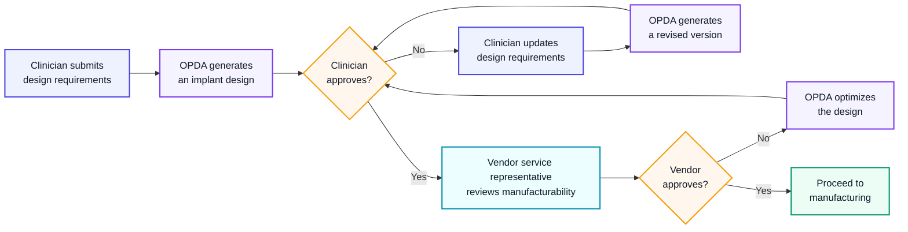

<a id="top"></a>

<div align="center">

<br>

# 

### OPDA: Orbital PSI Design Agent

**Human-supervised agentic AI for point-of-care design of patient-specific orbital implants**

<br>

[](#project-status)
[](#software-release)
[](#human-opda-interaction)
[](#overview)

<br>

**[Overview](#overview) · [Why OPDA?](#why-opda) · [Architecture](#system-architecture) · [Core Modules](#core-modules) · [Usage](#how-to-use-opda) · [Evaluation](#evaluation-highlights) · [Human Interaction](#human-opda-interaction) · [Memory](#feedback-driven-memory)**

**[Software Release](#software-release) · [Project Status](#project-status) · [Data & Privacy](#data-and-privacy) · [Responsible Use](#responsible-use) · [Citation](#citation) · [Team](#team-and-collaboration) · [Contact](#contact) · [License](#license)**

<br>

> OPDA translates natural-language clinical instructions into three-dimensional orbital implant designs while keeping clinicians and biomedical engineers in control of all safety-critical decisions.

<br>

</div>

---

<a id="overview"></a>

## Overview
**OPDA** is a human-supervised AI agent system that designs patient-specific implants for orbital fracture reconstruction. 

<a id="end-to-end-workflow"></a>

### 🔄 End-to-End Workflow
**Instruction** ➔ **Anatomical Reconstruction** ➔ **Orbital Prediction** ➔ **Implant Design** ➔ **Expert Review** ➔ **Manufacturing**

<a id="key-features"></a>

### ✨ Key Features
* **Hybrid Core:** Integrates multimodal foundation models, statistical shape modeling, and deterministic geometry tools.
* **Interpretable Steps:** Unlike black-box end-to-end models, OPDA decomposes tasks, verifies intermediate outputs, and utilizes dedicated tools.
* **Human-in-the-Loop:** Continuously refines and revises implant geometry based on expert feedback.

> [!IMPORTANT]
> **Research Prototype Only.** <br>
> OPDA does not independently diagnose patients, determine treatment, or replace professional clinical and engineering review.

---

<a id="why-opda"></a>

## Why OPDA?
Traditional orbital implant design is fragmented, manual, and slow. **OPDA unifies this process into a coordinated, human-supervised AI workflow.**

<table width="100%">
<tr>
<td align="center" width="33%"><b>💬 Clinical Interaction</b><br><small>Translates natural language into structured design actions.</small></td>
<td align="center" width="34%"><b>🧠 Agentic Orchestration</b><br><small>Specialized agents plan, execute, and iterate automatically.</small></td>
<td align="center" width="33%"><b>🧑‍⚕️ Human Oversight</b><br><small>Experts retain control over design, fixation, and release.</small></td>
</tr>
</table>

<p align="center"><b>Intent</b> ➔ <b>Planning</b> ➔ <b>Execution</b> ➔ <b>Approval</b></p>

---

<a id="system-architecture"></a>

## System Architecture


---
<a id="core-modules"></a>

## Core Modules
<table width="100%" cellpadding="10">

<tr>
<td align="center" valign="middle">
<b>🤖&nbsp;OPDA Orchestrator</b>&nbsp;<kbd>CONTROL</kbd><br>
<sub>Workflow planning, agent coordination, and revision management</sub>
</td>

<td align="center" valign="middle">
<b>📐&nbsp;Mesh Agent</b>&nbsp;<kbd>ANATOMY</kbd><br>
<sub>Anatomy segmentation, surface reconstruction, and mesh generation</sub>
</td>

<td align="center" valign="middle">
<b>🎯&nbsp;Spatial Aligner</b>&nbsp;<kbd>ALIGNMENT</kbd><br>
<sub>Landmark localization and standardized anatomical alignment</sub>
</td>
</tr>

<tr>
<td align="center" valign="middle">
<b>🔮&nbsp;Mesh Predictor</b>&nbsp;<kbd>PREDICTION</kbd><br>
<sub>Surface prediction via SSm and design of the intended orbital PSI base</sub>
</td>

<td align="center" valign="middle">
<b>🔨&nbsp;Design Agent</b>&nbsp;<kbd>DESIGN</kbd><br>
<sub>Implant modelling, perforation, fixation, and geometry optimization</sub>
</td>

<td align="center" valign="middle">
<b>🖨️&nbsp;Print Agent</b>&nbsp;<kbd>MANUFACTURING</kbd><br>
<sub>Model validation, fabrication preparation, and manufacturing handoff</sub>
</td>
</tr>

<tr>
<td colspan="3" align="center" valign="middle">
<b>💾&nbsp;Memory System</b>&nbsp;<kbd>ADAPTATION</kbd><br>
<sub>Secure reuse of institution-specific expert feedback and design experience</sub>
</td>
</tr>

</table>

---
<a id="how-to-use-opda"></a>

## How to Use OPDA
> 📚 **Tutorial book:** Coming soon (Pending release) <br>
> 🎬 **Tutorial Video:** Coming soon (Pending release) <br>
> 

---
<a id="evaluation-highlights"></a>

## Evaluation Highlights
<div align="center" style="width: 100%; text-align: center; margin: 0 auto; font-family: -apple-system, BlinkMacSystemFont, 'Segoe UI', Roboto, 'Helvetica Neue', Arial, sans-serif; -webkit-font-smoothing: antialiased;">
  <table width="100%" style="width: 100%; border-collapse: separate; border-spacing: 18px; margin: 0 auto; table-layout: fixed;">
    <tr>
      <!-- 卡片 1 -->
      <td align="center" style="background: #f8fafc; border: 1px solid #e2e8f0; border-radius: 16px; padding: 32px 20px; text-align: center; vertical-align: middle;">
        <div style="font-size: 11px; font-weight: 700; color: #64748b; letter-spacing: 0.08em; text-transform: uppercase; margin-bottom: 8px; text-align: center;">💀 Multi-Centre Validation</div>
        <div style="font-size: 24px; font-weight: 800; color: #0f172a; margin-bottom: 8px; letter-spacing: -0.03em; text-align: center;">168 assemblies · 15 units</div>
        <div style="font-size: 12.5px; color: #64748b; font-weight: 400; text-align: center;">Printed PSI–skull evaluation</div>
      </td>
      <!-- 卡片 2 -->
      <td align="center" style="background: #f8fafc; border: 1px solid #e2e8f0; border-radius: 16px; padding: 32px 20px; text-align: center; vertical-align: middle;">
        <div style="font-size: 11px; font-weight: 700; color: #64748b; letter-spacing: 0.08em; text-transform: uppercase; margin-bottom: 8px; text-align: center;">⭐ Expert Usability</div>
        <div style="font-size: 24px; font-weight: 800; color: #0f172a; margin-bottom: 8px; letter-spacing: -0.03em; text-align: center;">3.88 / 5</div>
        <div style="font-size: 12.5px; color: #64748b; font-weight: 400; text-align: center;">Mean multi-centre usability score</div>
      </td>
      <!-- 卡片 3 -->
      <td align="center" style="background: #f8fafc; border: 1px solid #e2e8f0; border-radius: 16px; padding: 32px 20px; text-align: center; vertical-align: middle;">
        <div style="font-size: 11px; font-weight: 700; color: #64748b; letter-spacing: 0.08em; text-transform: uppercase; margin-bottom: 8px; text-align: center;">⚡ Design Efficiency</div>
        <div style="font-size: 24px; font-weight: 800; color: #0f172a; margin-bottom: 8px; letter-spacing: -0.03em; text-align: center;">9.03 min · USD 1.91</div>
        <div style="font-size: 12.5px; color: #64748b; font-weight: 400; text-align: center;">Mean time and estimated cost per case</div>
      </td>
    </tr>
    <tr>
      <!-- 卡片 4：针对核心增长指标做了柔和的高亮高质感微调 -->
      <td align="center" style="background: #f0fdf4; border: 1px solid #bbf7d0; border-radius: 16px; padding: 32px 20px; text-align: center; vertical-align: middle;">
        <div style="font-size: 11px; font-weight: 700; color: #166534; letter-spacing: 0.08em; text-transform: uppercase; margin-bottom: 8px; text-align: center;">📈 Memory Adaptation</div>
        <div style="font-size: 24px; font-weight: 800; color: #15803d; margin-bottom: 8px; letter-spacing: -0.03em; text-align: center;">55% → 81%</div>
        <div style="font-size: 12.5px; color: #166534; font-weight: 400; opacity: 0.85; text-align: center;">First-pass acceptance after adaptation</div>
      </td>
      <!-- 卡片 5 -->
      <td align="center" style="background: #f8fafc; border: 1px solid #e2e8f0; border-radius: 16px; padding: 32px 20px; text-align: center; vertical-align: middle;">
        <div style="font-size: 11px; font-weight: 700; color: #64748b; letter-spacing: 0.08em; text-transform: uppercase; margin-bottom: 8px; text-align: center;">📐 Segmentation</div>
        <div style="font-size: 24px; font-weight: 800; color: #0f172a; margin-bottom: 8px; letter-spacing: -0.03em; text-align: center;">Dice 0.93 ± 0.03</div>
        <div style="font-size: 12.5px; color: #64748b; font-weight: 400; text-align: center;">HD95: 2.62 ± 0.51 mm</div>
      </td>
      <!-- 卡片 6 -->
      <td align="center" style="background: #f8fafc; border: 1px solid #e2e8f0; border-radius: 16px; padding: 32px 20px; text-align: center; vertical-align: middle;">
        <div style="font-size: 11px; font-weight: 700; color: #64748b; letter-spacing: 0.08em; text-transform: uppercase; margin-bottom: 8px; text-align: center;">👁️ Orbital Prediction</div>
        <div style="font-size: 24px; font-weight: 800; color: #0f172a; margin-bottom: 8px; letter-spacing: -0.03em; text-align: center;">0.65 mm</div>
        <div style="font-size: 12.5px; color: #64748b; font-weight: 400; text-align: center;">Internal mean surface distance</div>
      </td>
    </tr>
  </table>

  <!-- 底部注脚微调 -->
  <p align="center" style="margin-top: 20px; font-size: 12px; color: #94a3b8; letter-spacing: 0.02em; text-align: center;">
    <i>Results reflect performance in the evaluated research setting.</i>
  </p>

</div>

---

<a id="human-opda-interaction"></a>

## Human–OPDA Interaction


<p align="center">
  <sub>
    Revised or optimized designs must be approved by the clinician before manufacturing.
  </sub>
</p>


---

<a id="feedback-driven-memory"></a>

## Feedback-Driven Memory
OPDA converts expert corrections into reusable, institution-specific design experience, allowing future cases to benefit from previous review without sharing patient-level data or updating foundation-model weights.

<table width="100%" cellpadding="10">

<tr>
<td align="center" valign="middle">
<b>📈&nbsp; Higher First-Pass Acceptance</b><br>
<sub>Reuse validated corrections to improve initial design quality</sub>
</td>

<td align="center" valign="middle">
<b>🏥&nbsp; Local Adaptation</b><br>
<sub>Capture institution-specific design preferences and workflows</sub>
</td>

<td align="center" valign="middle">
<b>⚡&nbsp; Fewer Revisions</b><br>
<sub>Reduce repeated interaction and unnecessary redesign</sub>
</td>
</tr>

</table>

> [!NOTE]
> Memory effectiveness and transferability are task-dependent. Some preferences, particularly fixation-hole placement, may remain highly institution-specific.

---

<a id="software-release"></a>

## Software Release
OPDA is being prepared for public release as an integrated **Windows executable installer**, providing a unified interface without requiring users to manually configure the complete software environment.

<table width="100%" cellpadding="10">
<tr>
<td align="center" valign="middle">
<b>🪟&nbsp; Windows Installer</b>&nbsp;<kbd>PUBLIC</kbd><br>
<sub>Integrated executable package for streamlined installation</sub>
</td>

<td align="center" valign="middle">
<b>📖&nbsp; Documentation</b>&nbsp;<kbd>PUBLIC</kbd><br>
<sub>Installation guide, user manual, and responsible-use guidance</sub>
</td>

<td align="center" valign="middle">
<b>🧪&nbsp; Examples</b>&nbsp;<kbd>PUBLIC</kbd><br>
<sub>Example instructions, outputs, and demonstration videos</sub>
</td>
</tr>

<tr>
<td align="center" valign="middle">
<b>📊&nbsp; Evaluation Tools</b>&nbsp;<kbd>WHERE PERMITTED</kbd><br>
<sub>Selected evaluation scripts and reproducibility resources</sub>
</td>

<td align="center" valign="middle">
<b>🔐&nbsp; Clinical Data</b>&nbsp;<kbd>RESTRICTED</kbd><br>
<sub>Patient-level and restricted institutional data will not be distributed</sub>
</td>

<td align="center" valign="middle">
<b>🧠&nbsp; Model Access</b>&nbsp;<kbd>USER CONFIGURED</kbd><br>
<sub>External API credentials or supported locally hosted models</sub>
</td>
</tr>
</table>

> [!IMPORTANT]
> Users must provide their own API credentials for external large-language-model services. Privacy-sensitive and institution-specific modules may instead be operated using supported locally hosted models.

<details>
<summary><strong>📁 Planned repository structure</strong></summary>

```text
OPDA/
├── README.md
├── docs/
│   ├── system_overview.md
│   ├── installation.md
│   ├── user_guide.md
│   └── responsible_use.md
├── examples/
│   ├── example_instructions/
│   └── example_outputs/
├── assets/
│   ├── figures/
│   └── videos/
├── installer/
└── LICENSE
```

</details>

---

<a id="project-status"></a>

## Project Status
- [x] Agentic workflow development
- [x] Simulated-case evaluation
- [x] Multi-centre printed-model assessment
- [x] Feedback-driven memory evaluation
- [ ] Public Windows installer
- [ ] Demonstration cases
- [ ] Installation and user documentation
- [ ] Additional local-model backends
- [ ] Prospective clinical evaluation
- [ ] Regulatory and quality-management preparation

---

<a id="data-and-privacy"></a>

## Data and Privacy
OPDA was developed and evaluated using retrospective, de-identified data under institutional approvals and applicable data-use conditions.

<table width="100%" cellpadding="10">
<tr>
<td align="center" valign="middle">
<b>💻&nbsp; Local Processing</b><br>
<sub>Sensitive clinical data can remain within the institutional environment</sub>
</td>
<td align="center" valign="middle">
<b>🛡️&nbsp; Prompt Isolation</b><br>
<sub>Patient-identifiable information is excluded from external LLM prompts</sub>
</td>
<td align="center" valign="middle">
<b>🏥&nbsp; Institution-Specific Memory</b><br>
<sub>Local experience is reused without cross-centre patient-level sharing</sub>
</td>
</tr>
<tr>
<td align="center" valign="middle">
<b>🧠&nbsp; Local-Model Deployment</b><br>
<sub>Privacy-sensitive modules can use supported locally hosted models</sub>
</td>
<td align="center" valign="middle">
<b>🧑‍⚕️&nbsp; Expert Review</b><br>
<sub>Human approval remains mandatory before manufacturing release</sub>
</td>
<td align="center" valign="middle">
<b>📋&nbsp; Responsible Deployment</b><br>
<sub>Local validation, governance, and quality controls remain required</sub>
</td>
</tr>
</table>

> [!IMPORTANT]
> Users are responsible for compliance with applicable ethics approvals, data-protection laws, institutional policies, medical-device requirements, and quality-management procedures.

---

<a id="responsible-use"></a>

## Responsible Use
> [!WARNING]
> **OPDA is a research prototype and is not a certified medical device.**  
> It must not be used as an autonomous clinical decision-making or manufacturing system.

<table width="100%" cellpadding="10">
<tr>
<td align="center" valign="middle">
<b>🩺&nbsp; No Autonomous Diagnosis</b><br>
<sub>OPDA must not independently diagnose patients or interpret clinical conditions</sub>
</td>

<td align="center" valign="middle">
<b>⚖️&nbsp; No Treatment Decisions</b><br>
<sub>Surgical indications and treatment strategies must be determined by qualified clinicians</sub>
</td>

<td align="center" valign="middle">
<b>🧑‍⚕️&nbsp; No Expert Replacement</b><br>
<sub>OPDA supports, but does not replace, surgeons or biomedical engineers</sub>
</td>
</tr>

<tr>
<td align="center" valign="middle">
<b>🏭&nbsp; No Direct Manufacturing</b><br>
<sub>Implants must not be manufactured without clinical and engineering approval</sub>
</td>

<td align="center" valign="middle">
<b>🔐&nbsp; Authorized Data Only</b><br>
<sub>Patient data must be processed under appropriate authorization and governance</sub>
</td>

<td align="center" valign="middle">
<b>📋&nbsp; Institutional Oversight</b><br>
<sub>Local validation, risk management, and quality procedures must not be bypassed</sub>
</td>
</tr>
</table>

> [!IMPORTANT]
> Any clinical or translational deployment requires independent validation, risk assessment, regulatory review, and formal approval by the responsible institution.

---

<a id="citation"></a>

## Citation
A formal citation will be added after publication.

```bibtex
@article{gao_opda,
  title   = {Agentic AI for point-of-care design of patient-specific orbital implants},
  author  = {Gao, Yao and others},
  journal = {Under review},
  year    = {2026}
}
```

---

<a id="team-and-collaboration"></a>

## Team and Collaboration
OPDA brings together clinicians, biomedical engineers, computer scientists, and manufacturing partners. The project is coordinated by the oral and maxillofacial surgery research team at **KU Leuven and University Hospitals Leuven**.

<table width="100%" cellpadding="10">
<tr>

<td align="center" valign="middle">
<b>🦴&nbsp; Patient-Specific Implants</b><br>
<sub>Automated planning and design of craniofacial implants</sub>
</td>

<td align="center" valign="middle">
<b>🤖&nbsp; Agentic AI for Surgery</b><br>
<sub>Tool-using AI systems for complex clinical workflows</sub>
</td>

<td align="center" valign="middle">
<b>🩻&nbsp; Craniofacial Image Analysis</b><br>
<sub>Segmentation, alignment, and anatomical reconstruction</sub>
</td>

</tr>
<tr>

<td align="center" valign="middle">
<b>📐&nbsp; Statistical Shape Modelling</b><br>
<sub>Patient-specific anatomical prediction and reconstruction</sub>
</td>

<td align="center" valign="middle">
<b>🖨️&nbsp; Medical 3D Printing</b><br>
<sub>Design-to-manufacturing integration and validation</sub>
</td>

<td align="center" valign="middle">
<b>🌍&nbsp; Multi-Centre Validation</b><br>
<sub>Clinical evaluation across institutions and specialties</sub>
</td>

</tr>
</table>

<p align="center">
  <sub>We welcome academic, clinical, engineering, and manufacturing collaborations related to OPDA.</sub>
</p>

---

<a id="contact"></a>

<div align="center" style="width: 100%; text-align: center; margin: 0 auto; font-family: -apple-system, BlinkMacSystemFont, 'Segoe UI', Roboto, 'Helvetica Neue', Arial, sans-serif; -webkit-font-smoothing: antialiased;">

  <!-- Main Section Title -->
  <h2 style="margin-bottom: 24px; font-size: 1.8em; font-weight: 700; color: #0f172a; text-align: center; letter-spacing: -0.02em;">📬 Contact</h2>

  <!-- 1. Primary Contact Hero Card (Full Width) -->
  <table width="100%" style="width: 100%; border-collapse: separate; border-spacing: 18px; margin: 0 auto; table-layout: fixed;">
    <tr>
      <td align="center" style="background: #f8fafc; border: 1px solid #e2e8f0; border-radius: 16px; padding: 36px 24px; text-align: center; vertical-align: middle;">
        <!-- Name & Modern Tech Badge -->
        <div style="font-size: 22px; font-weight: 800; color: #0f172a; margin-bottom: 12px; text-align: center; letter-spacing: -0.01em;">
          👤 Yao Gao &nbsp;
          <span style="font-size: 10.5px; font-weight: 700; color: #1d4ed8; background: #eff6ff; border: 1px solid #bfdbfe; padding: 4px 10px; border-radius: 20px; letter-spacing: 0.06em; vertical-align: middle;">PROJECT CONTACT</span>
        </div>
        <!-- Institutional Affiliations -->
        <div style="font-size: 14px; color: #475569; font-weight: 500; margin-bottom: 4px; text-align: center;">Department of Oral and Maxillofacial Surgery</div>
        <div style="font-size: 13.5px; color: #64748b; margin-bottom: 18px; text-align: center;">KU Leuven / University Hospitals Leuven · Leuven, Belgium</div>
        <!-- Premium Minimalist Link -->
        <div style="text-align: center;">
          <a href="mailto:yao.gao@kuleuven.be" style="font-size: 14.5px; color: #2563eb; text-decoration: none; font-weight: 600; border-bottom: 1px dashed #2563eb; padding-bottom: 2px;">yao.gao@kuleuven.be</a>
        </div>
      </td>
    </tr>
  </table>

  <!-- Sub-section Divider Title -->
  <a id="supervisors"></a>

<div style="font-size: 11px; font-weight: 700; color: #64748b; letter-spacing: 0.08em; text-transform: uppercase; margin: 24px 0 6px 0; text-align: center;">🎓 Supervisors</div>

  <!-- 2. Supervisors Grid (3 Columns, Fully Balanced) -->
  <table width="100%" style="width: 100%; border-collapse: separate; border-spacing: 18px; margin: 0 auto; table-layout: fixed;">
    <tr>
      <!-- Supervisor 1 -->
      <td align="center" style="background: #f8fafc; border: 1px solid #e2e8f0; border-radius: 16px; padding: 28px 16px; text-align: center; vertical-align: middle;">
        <div style="font-size: 16.5px; font-weight: 700; color: #0f172a; margin-bottom: 8px; text-align: center;">Robin Willaert</div>
        <div style="font-size: 12.5px; color: #64748b; margin-bottom: 16px; line-height: 1.5; text-align: center;">KU Leuven /<br>University Hospitals Leuven</div>
        <div style="text-align: center;">
          <a href="mailto:robin.willaert@uzleuven.be" style="font-size: 13px; color: #2563eb; text-decoration: none; font-weight: 500;">robin.willaert@uzleuven.be</a>
        </div>
      </td>
      <!-- Supervisor 2 -->
      <td align="center" style="background: #f8fafc; border: 1px solid #e2e8f0; border-radius: 16px; padding: 28px 16px; text-align: center; vertical-align: middle;">
        <div style="font-size: 16.5px; font-weight: 700; color: #0f172a; margin-bottom: 8px; text-align: center;">Jeroen Van Dessel</div>
        <div style="font-size: 12.5px; color: #64748b; margin-bottom: 16px; line-height: 1.5; text-align: center;">KU Leuven /<br>University Hospitals Leuven</div>
        <div style="text-align: center;">
          <a href="mailto:jeroen.vandessel@kuleuven.be" style="font-size: 13px; color: #2563eb; text-decoration: none; font-weight: 500;">jeroen.vandessel@kuleuven.be</a>
        </div>
      </td>
      <!-- Supervisor 3 -->
      <td align="center" style="background: #f8fafc; border: 1px solid #e2e8f0; border-radius: 16px; padding: 28px 16px; text-align: center; vertical-align: middle;">
        <div style="font-size: 16.5px; font-weight: 700; color: #0f172a; margin-bottom: 8px; text-align: center;">Yi Sun</div>
        <div style="font-size: 12.5px; color: #64748b; margin-bottom: 16px; line-height: 1.5; text-align: center;">KU Leuven /<br>University Hospitals Leuven</div>
        <div style="text-align: center;">
          <a href="mailto:yi.sun@uzleuven.be" style="font-size: 13px; color: #2563eb; text-decoration: none; font-weight: 500;">yi.sun@uzleuven.be</a>
        </div>
      </td>
    </tr>
  </table>

</div>

---

<a id="license"></a>

## License
The software license and third-party component notices will be provided with the public release.

Until then, all rights are reserved unless explicitly stated otherwise.

---

<div align="center">

<br>

### From clinical intent to manufacturing preparation

**OPDA connects clinicians, computational modelling, and medical 3D printing through a human-supervised agentic AI workflow.**

<br>

</div>
