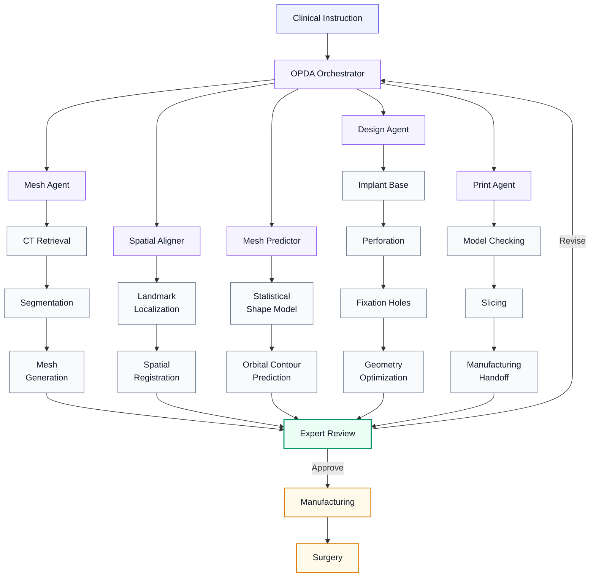
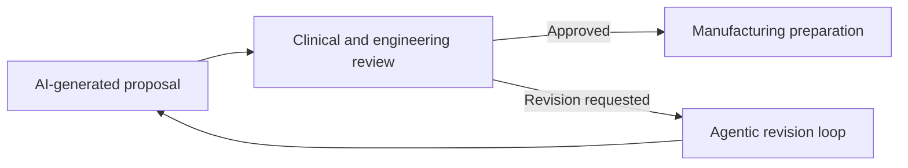

<div align="center">

<br>

# 

### OPDA: Orbital PSI Design Agent

**Human-supervised agentic AI for point-of-care design of patient-specific orbital implants**

<br>

[](#project-status)
[](#software-release)
[](#human-oversight)
[](#overview)

<br>

**[Overview](#overview) · [Architecture](#system-architecture) · [Results](#evaluation-highlights) · [Release](#software-release) · [Responsible Use](#responsible-use) · [Contact](#contact)**

<br>

> OPDA translates natural-language clinical instructions into three-dimensional orbital implant designs while keeping clinicians and biomedical engineers in control of all safety-critical decisions.

<br>

</div>

---

## Overview

**OPDA** is a human-supervised AI agent system that designs patient-specific implants for orbital fracture reconstruction. 

### 🔄 End-to-End Workflow
**Instruction** ➔ **Anatomical Reconstruction** ➔ **Orbital Prediction** ➔ **Implant Design** ➔ **Expert Review** ➔ **Manufacturing**

### ✨ Key Features
* **Hybrid Core:** Integrates multimodal foundation models, statistical shape modeling, and deterministic geometry tools.
* **Interpretable Steps:** Unlike black-box end-to-end models, OPDA decomposes tasks, verifies intermediate outputs, and utilizes dedicated tools.
* **Human-in-the-Loop:** Continuously refines and revises implant geometry based on expert feedback.

> [!IMPORTANT]
> **Research Prototype Only.** <br>
> OPDA does not independently diagnose patients, determine treatment, or replace professional clinical and engineering review.

---

## Why OPDA?

Traditional orbital implant design is fragmented, manual, and slow. **OPDA unifies this process into a coordinated, human-supervised AI workflow.**

<table width="100%">
<tr>
<td align="center" width="33%"><b>💬 Clinical Interaction</b><br><small>Translates natural language into structured design actions.</small></td>
<td align="center" width="34%"><b>🧠 Agentic Orchestration</b><br><small>Specialized agents plan, execute, and iterate automatically.</small></td>
<td align="center" width="33%"><b>🧑‍⚕️ Human Oversight</b><br><small>Experts retain control over design, fixation, and release.</small></td>
</tr>
</table>

<p align="center"><b>Intent</b> ➔ <b>Planning</b> ➔ <b>Execution</b> ➔ <b>Approval</b></p>

---

## System Architecture



---
## Core Modules

<table width="100%" cellpadding="10">

<tr>
<td align="center" valign="middle">
<b>🤖&nbsp;OPDA Orchestrator</b>&nbsp;<kbd>CONTROL</kbd><br>
<sub>Workflow planning, agent coordination, and revision management</sub>
</td>

<td align="center" valign="middle">
<b>📐&nbsp;Mesh Agent</b>&nbsp;<kbd>ANATOMY</kbd><br>
<sub>Anatomy segmentation, surface reconstruction, and mesh generation</sub>
</td>

<td align="center" valign="middle">
<b>🎯&nbsp;Spatial Aligner</b>&nbsp;<kbd>ALIGNMENT</kbd><br>
<sub>Landmark localization and standardized anatomical alignment</sub>
</td>
</tr>

<tr>
<td align="center" valign="middle">
<b>🔮&nbsp;Mesh Predictor</b>&nbsp;<kbd>PREDICTION</kbd><br>
<sub>Surface prediction via SSm and design of the intended orbital PSI base</sub>
</td>

<td align="center" valign="middle">
<b>🔨&nbsp;Design Agent</b>&nbsp;<kbd>DESIGN</kbd><br>
<sub>Implant modelling, perforation, fixation, and geometry optimization</sub>
</td>

<td align="center" valign="middle">
<b>🖨️&nbsp;Print Agent</b>&nbsp;<kbd>MANUFACTURING</kbd><br>
<sub>Model validation, fabrication preparation, and manufacturing handoff</sub>
</td>
</tr>

<tr>
<td colspan="3" align="center" valign="middle">
<b>💾&nbsp;Memory System</b>&nbsp;<kbd>ADAPTATION</kbd><br>
<sub>Secure reuse of institution-specific expert feedback and design experience</sub>
</td>
</tr>

</table>

---
## How to use OPDA

> 🎬 **Tutorial Video:** Coming soon (Pending release)

---
## Evaluation Highlight
<div align="center" style="width: 100%; text-align: center; margin: 0 auto; font-family: -apple-system, BlinkMacSystemFont, 'Segoe UI', Roboto, 'Helvetica Neue', Arial, sans-serif; -webkit-font-smoothing: antialiased;">
  <table width="100%" style="width: 100%; border-collapse: separate; border-spacing: 18px; margin: 0 auto; table-layout: fixed;">
    <tr>
      <!-- 卡片 1 -->
      <td align="center" style="background: #f8fafc; border: 1px solid #e2e8f0; border-radius: 16px; padding: 32px 20px; text-align: center; vertical-align: middle;">
        <div style="font-size: 11px; font-weight: 700; color: #64748b; letter-spacing: 0.08em; text-transform: uppercase; margin-bottom: 8px; text-align: center;">💀 Multi-Centre Validation</div>
        <div style="font-size: 24px; font-weight: 800; color: #0f172a; margin-bottom: 8px; letter-spacing: -0.03em; text-align: center;">168 assemblies · 15 units</div>
        <div style="font-size: 12.5px; color: #64748b; font-weight: 400; text-align: center;">Printed PSI–skull evaluation</div>
      </td>
      <!-- 卡片 2 -->
      <td align="center" style="background: #f8fafc; border: 1px solid #e2e8f0; border-radius: 16px; padding: 32px 20px; text-align: center; vertical-align: middle;">
        <div style="font-size: 11px; font-weight: 700; color: #64748b; letter-spacing: 0.08em; text-transform: uppercase; margin-bottom: 8px; text-align: center;">⭐ Expert Usability</div>
        <div style="font-size: 24px; font-weight: 800; color: #0f172a; margin-bottom: 8px; letter-spacing: -0.03em; text-align: center;">3.88 / 5</div>
        <div style="font-size: 12.5px; color: #64748b; font-weight: 400; text-align: center;">Mean multi-centre usability score</div>
      </td>
      <!-- 卡片 3 -->
      <td align="center" style="background: #f8fafc; border: 1px solid #e2e8f0; border-radius: 16px; padding: 32px 20px; text-align: center; vertical-align: middle;">
        <div style="font-size: 11px; font-weight: 700; color: #64748b; letter-spacing: 0.08em; text-transform: uppercase; margin-bottom: 8px; text-align: center;">⚡ Design Efficiency</div>
        <div style="font-size: 24px; font-weight: 800; color: #0f172a; margin-bottom: 8px; letter-spacing: -0.03em; text-align: center;">9.03 min · USD 1.91</div>
        <div style="font-size: 12.5px; color: #64748b; font-weight: 400; text-align: center;">Mean time and estimated cost per case</div>
      </td>
    </tr>
    <tr>
      <!-- 卡片 4：针对核心增长指标做了柔和的高亮高质感微调 -->
      <td align="center" style="background: #f0fdf4; border: 1px solid #bbf7d0; border-radius: 16px; padding: 32px 20px; text-align: center; vertical-align: middle;">
        <div style="font-size: 11px; font-weight: 700; color: #166534; letter-spacing: 0.08em; text-transform: uppercase; margin-bottom: 8px; text-align: center;">📈 Memory Adaptation</div>
        <div style="font-size: 24px; font-weight: 800; color: #15803d; margin-bottom: 8px; letter-spacing: -0.03em; text-align: center;">55% → 81%</div>
        <div style="font-size: 12.5px; color: #166534; font-weight: 400; opacity: 0.85; text-align: center;">First-pass acceptance after adaptation</div>
      </td>
      <!-- 卡片 5 -->
      <td align="center" style="background: #f8fafc; border: 1px solid #e2e8f0; border-radius: 16px; padding: 32px 20px; text-align: center; vertical-align: middle;">
        <div style="font-size: 11px; font-weight: 700; color: #64748b; letter-spacing: 0.08em; text-transform: uppercase; margin-bottom: 8px; text-align: center;">📐 Segmentation</div>
        <div style="font-size: 24px; font-weight: 800; color: #0f172a; margin-bottom: 8px; letter-spacing: -0.03em; text-align: center;">Dice 0.93 ± 0.03</div>
        <div style="font-size: 12.5px; color: #64748b; font-weight: 400; text-align: center;">HD95: 2.62 ± 0.51 mm</div>
      </td>
      <!-- 卡片 6 -->
      <td align="center" style="background: #f8fafc; border: 1px solid #e2e8f0; border-radius: 16px; padding: 32px 20px; text-align: center; vertical-align: middle;">
        <div style="font-size: 11px; font-weight: 700; color: #64748b; letter-spacing: 0.08em; text-transform: uppercase; margin-bottom: 8px; text-align: center;">👁️ Orbital Prediction</div>
        <div style="font-size: 24px; font-weight: 800; color: #0f172a; margin-bottom: 8px; letter-spacing: -0.03em; text-align: center;">0.65 mm</div>
        <div style="font-size: 12.5px; color: #64748b; font-weight: 400; text-align: center;">Internal mean surface distance</div>
      </td>
    </tr>
  </table>

  <!-- 底部注脚微调 -->
  <p align="center" style="margin-top: 20px; font-size: 12px; color: #94a3b8; letter-spacing: 0.02em; text-align: center;">
    <i>Results reflect performance in the evaluated research setting.</i>
  </p>

</div>

---

## Human Oversight

OPDA is designed around **mandatory expert approval**, not autonomous clinical execution.

Expert review is required for:

- segmentation quality;
- anatomical alignment;
- predicted orbital contour;
- implant coverage and geometry;
- perforation and fixation-hole placement;
- structural and manufacturing constraints;
- final release for fabrication.



---

## Feedback-Driven Memory

OPDA can convert expert corrections into reusable local design experience.

The memory system is intended to:

- improve first-pass design acceptance;
- adapt to institution-specific design preferences;
- reduce repeated interaction and revision;
- preserve human approval at safety-critical stages;
- avoid cross-centre sharing of patient-level data;
- operate without updating foundation-model weights.

> [!NOTE]
> Memory transferability may differ across design tasks. Some preferences, particularly fixation-hole placement, can remain strongly institution-specific.

---

## Software Release

The complete OPDA software is being prepared for public release as an integrated **Windows executable installer**.

The planned release is intended to minimize environment configuration and provide a unified interface for the full workflow.

### Planned distribution

| Component | Planned availability |
|---|---|
| Windows installer | Public release |
| Example instructions and outputs | Public release |
| User and installation guides | Public release |
| Demonstration videos | Public release |
| Evaluation scripts | Where permitted |
| Patient or restricted clinical data | **Not distributed** |
| External LLM credentials | Provided by the user |
| Local-model support | Available for selected modules |

Users will need to configure their own API credentials for external large-language-model services used by selected modules. Privacy-sensitive or institution-specific functions may be operated with locally hosted models.

<details>
<summary><strong>Planned repository structure</strong></summary>

```text
OPDA/
├── README.md
├── docs/
│   ├── system_overview.md
│   ├── installation.md
│   ├── user_guide.md
│   └── responsible_use.md
├── examples/
│   ├── example_instructions/
│   └── example_outputs/
├── assets/
│   ├── figures/
│   └── videos/
├── installer/
└── LICENSE
```

</details>

---

## Project Status

**Current stage:** research prototype, manuscript review, software packaging, documentation, and release preparation.

- [x] Agentic workflow development
- [x] Simulated-case evaluation
- [x] Multi-centre printed-model assessment
- [x] Feedback-driven memory evaluation
- [ ] Public Windows installer
- [ ] Demonstration cases
- [ ] Installation and user documentation
- [ ] Additional local-model backends
- [ ] Prospective clinical evaluation
- [ ] Regulatory and quality-management preparation

---

## Data and Privacy

OPDA was developed and evaluated using retrospective, de-identified data under institutional approvals and applicable data-use conditions.

The architecture supports:

- local processing of sensitive data;
- separation of patient data from external language-model prompts;
- institution-specific memory without cross-centre patient-level sharing;
- configurable local-model deployment;
- expert review before manufacturing.

Users are responsible for compliance with local ethics approvals, data-protection regulations, institutional policies, medical-device requirements, and quality-management procedures.

---

## Responsible Use

> [!WARNING]
> OPDA is not a certified medical device and must not be used as an autonomous clinical decision or manufacturing system.

OPDA must not be used to:

- independently diagnose a patient;
- determine whether surgery is indicated;
- replace qualified surgeons or biomedical engineers;
- directly manufacture an implant without expert review;
- process patient data without appropriate authorization;
- bypass institutional validation or quality-management procedures.

Any clinical or translational use requires independent validation, risk assessment, regulatory review, and approval by the responsible institution.

---

## Citation

A formal citation will be added after publication.

```bibtex
@article{gao_opda,
  title   = {Agentic AI for point-of-care design of patient-specific orbital implants},
  author  = {Gao, Yao and others},
  journal = {Under review},
  year    = {2026}
}
```

---

## Team and Collaboration

OPDA was developed through collaboration among clinicians, biomedical engineers, computer scientists, and manufacturing partners, coordinated by the oral and maxillofacial surgery research team at **KU Leuven and University Hospitals Leuven**.

Potential collaboration areas include:

- patient-specific implant design;
- agentic AI for surgery;
- craniofacial image analysis;
- statistical shape modelling;
- medical 3D printing;
- human–AI collaboration;
- multi-centre clinical validation.

---

## Contact

<table>
<tr>
<td>

**Yao Gao**  
Department of Oral and Maxillofacial Surgery  
KU Leuven / University Hospitals Leuven  
Leuven, Belgium  

📧 `yao.gao@kuleuven.be`

</td>
</tr>
</table>

---

## License

The software license and third-party component notices will be provided with the public release.

Until then, all rights are reserved unless explicitly stated otherwise.

---

<div align="center">

<br>

### From clinical intent to manufacturing preparation

**OPDA connects clinicians, computational modelling, and medical 3D printing through a human-supervised agentic AI workflow.**

<br>

</div>
